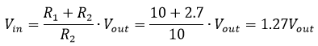

Example: Battery Measurement on a Mayfly
==============

An example sketch showing how to measure the voltage of a lithium polymer (LiPo) battery connected to a Mayfly board.

### Background

On the Mayfly, analog pin **A6** is connected to a resistor divider that measures the voltage of the battery connected to the LiPo jack.
This example shows the theory behind measuring and calculating the battery voltage, so this concept can be used in other sketches that are battery powered.

NOTE:  If the USB cable or an FTDI adapter is connected to the Mayfly (ie, to connect to the Serial Monitor) the measured voltage will be from the voltage from USB/FTDI cable (~5V) and not the voltage of the LiPo battery.

### Tech Details

The Mayfly board operates at 3.3V - below the voltage of a healthy LiPo battery (3.5V - 4.2V) - meaning that the battery voltage cannot be measured directly.
To lower the voltage to a level the Mayfly can safely measure, we put two resisters in series and measure the voltage between them.
That is, we use a (voltage divider)[https://en.wikipedia.org/wiki/Voltage_divider].
The formula (from Ohm's law) for the voltage measured across a voltage divider is:

If the resistors were exactly the same value, the measured voltage would be exactly half of the overall voltage.
On the newer versions of the Mayfly (v0.4, v0.5, v0.5b), the two resistors are set at 2.7MΩ and 10MΩ.
Adding those resistance values and solving for input voltage gives:

On the original Mayfly (v0.3 and older) the two resistors were set at 4.7MΩ and 10MΩ leading to a multiplier of 1.47 rather than 1.27.

The resolution of the analog measurement on Mayfly pin A6 is 10 bit.
Spread over the 3.3V range of the analog pin futher diluted by the voltage divider gives a final resolution of 0.016V = 16mV (or 0.005V = 5mV on the older Mayfly).
This level of resolution is more than sufficient to monitor battery health.
When reporting battery voltage, you should not report any further significant figures than the resolution of the measurement.
